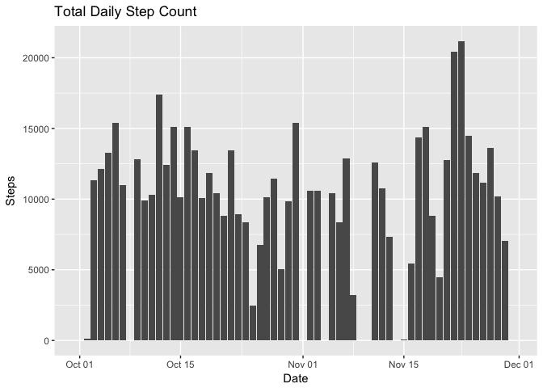
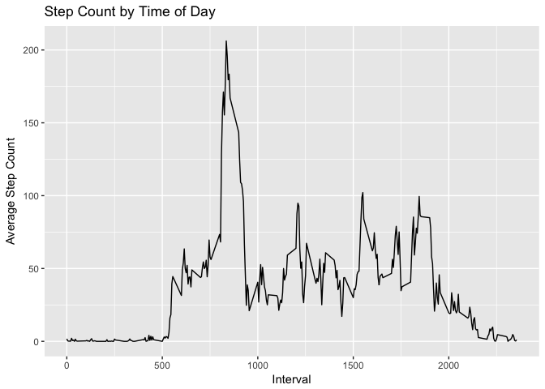
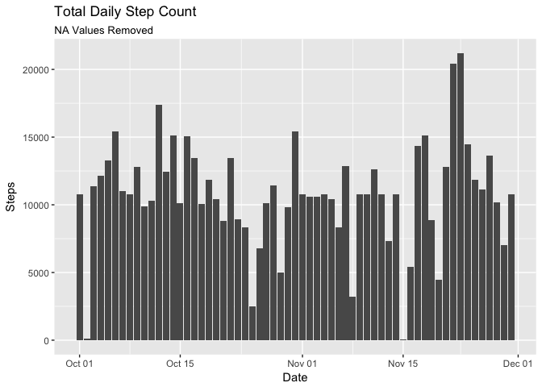
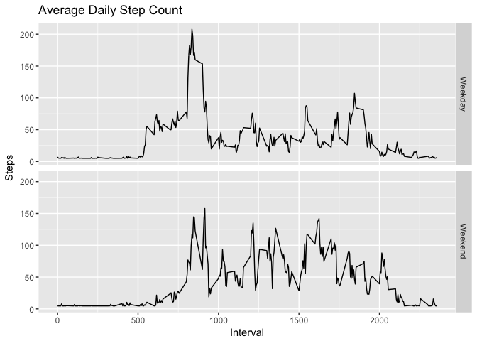

# Reproducible Research: Peer Assessment 1


## Loading and preprocessing the data
The necessary packages for this analysis were loaded: lubridate (date formatting), dplyr (data analysis), tidyr (data cleaning), ggplot2 (visualization).

```r
library(lubridate)
library(dplyr)
library(tidyr)
library(ggplot2)

unzip("activity.zip")
data <- read.csv("activity.csv", stringsAsFactors = FALSE)
data$date <- ymd(data$date)
```


## What is mean total number of steps taken per day?
An intermediate table of total daily step counts was first created to more easily calculate summary statistics.

```r
totals <- group_by(data, date) %>%
    summarize(total = sum(steps, na.rm = TRUE))

step_mean <- mean(totals$total)
step_median <- median(totals$total)
```
From this, the mean (9354.2295082) and median (10395) values of daily steps were computed. The total step count for each day is shown in the histogram below.


```r
ggplot(totals, aes(x = date, y = total)) +
    geom_col() +
    labs(x = "Date", y = "Steps", title = "Total Daily Step Count")
```

<!-- -->

```r
ggsave("./figure/orig_histogram.png")
```

```
## Saving 7 x 5 in image
```

## What is the average daily activity pattern?
To understand what the pattern of movement throughout a day is, an average step count was calculated at each time interval during the day. The interval with the maximum value was found to be interval 835.

```r
pat <- group_by(data, interval) %>%
    summarize(stepct = mean(steps, na.rm = TRUE)) 

max_interval <- pat[which.max(pat$stepct), "interval"]  # 835

ggplot(pat, aes(x = interval, y = stepct)) +
    geom_line() +
    labs(x = "Interval", y = "Average Step Count", title = "Step Count by Time of Day")
```

<!-- -->

```r
ggsave("./figure/orig_avg_step_count.png")
```

```
## Saving 7 x 5 in image
```


## Inputing missing values
The number of missing step values was found to be 2304. To fill in these values, the mean value for that day was used. If no data was available for that day, an average for the entire dataset was used.

```r
missing_values <- nrow(data[is.na(data$steps), ])  # 2304

mean_day <- group_by(data, date) %>% summarize(mean = mean(steps, na.rm = TRUE))
mean_full <- mean(data$steps, na.rm = TRUE)

# Create new dataset and add averaged values
new.data <- data.frame(steps = as.matrix(rep(NA, nrow(data))),
                       date = data$date,
                       interval = data$interval)
for (i in 1:nrow(data)) {
    
    if (!is.na(data$steps[i])) {
        # Use original dataset step counts
        new.data$steps[i] <- data$steps[i]
        next
    }
    
    if (is.nan(as.numeric(mean_day[mean_day$date == data$date[i], "mean"]))) {
        # No daily mean available
        new.data$steps[i] <- mean_full
    }
    else {
        # Use daily mean
        new.data$steps[i] <- mean_day[mean_day$date == data$date[i], "mean"]
    }
}

new.totals <- group_by(new.data, date) %>%
    summarize(total = sum(steps))

new.mean <- as.character(round(mean(new.totals$total), 2))
new.median <- as.character(round(median(new.totals$total), 2))
```

After filling in the missing data values, the daily summary statistics are recomputed as 10766.19 for the mean and 10766.19 for the median step count. These values are both higher than the original mean and median values. This is expected because new numeric values were added to days that had records containing only `NA` before, raising the total step counts for each day. The updated total daily step count histogram is shown below.


```r
ggplot(new.totals, aes(x = date, y = total)) +
    geom_col() +
    labs(x = "Date", y = "Steps", title = "Total Daily Step Count", 
         subtitle = "NA Values Removed")
```

<!-- -->

```r
ggsave("./figure/nona_histogram.png")
```

```
## Saving 7 x 5 in image
```

## Are there differences in activity patterns between weekdays and weekends?
Finally, to analyze activity from a week vs. weekend standpoint, a new column was first made that indicated which group each observation belonged to. The step counts were then averaged for each of the two groups at each interval timestamp. A panel plot of the results is shown below indicating a higher activity level during weekday mornings, but a higher activity level during the middle of the day on the weekends.

```r
new.data <- 
    mutate(new.data, dow = weekdays(date)) %>%
    mutate(period = ifelse(dow %in% c("Saturday", "Sunday"), "Weekend", "Weekday")) %>%
    group_by(period, interval) %>%
    summarize(avg = mean(steps))

ggplot(new.data, aes(x = interval, y = avg)) +
    geom_line() +
    facet_grid(period ~ .) + 
    labs(x = "Interval", y = "Steps", title = "Average Daily Step Count")
```

<!-- -->

```r
ggsave("./figure/nona_avg_step_count.png")
```

```
## Saving 7 x 5 in image
```


